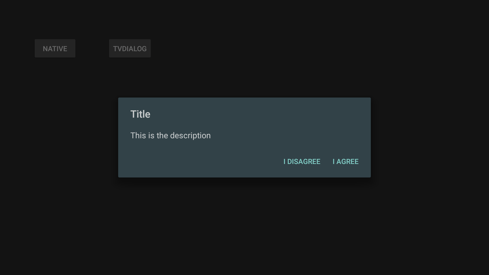
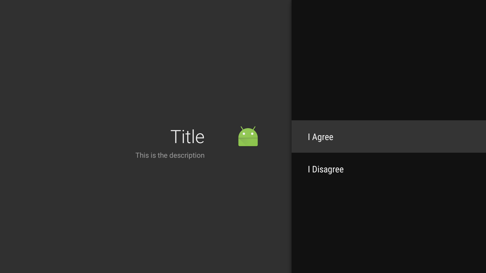

##TVDialog
 Android TV introduced the leanback library and at io 2015 they added the guided step fragment. This makes a more intuitive layout for things like dialogs on TV.
 below is a simple class I made that uses a GuidedStepFragment to replace dialogs on TV.
[GuidedStepFragment](https://developer.android.com/reference/android/support/v17/leanback/app/GuidedStepFragment.html)

##Before:

##After:
